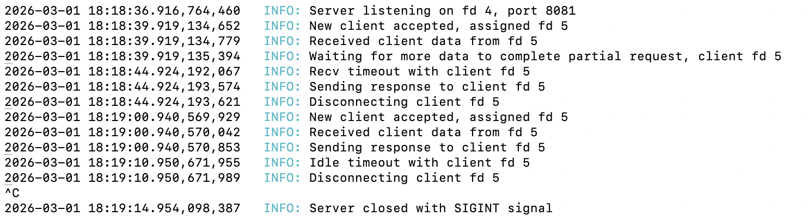

# Web server: an HTTP/1.1 server written in C++
Authors: [Johnny](https://github.com/zoni527), [Sonja](https://github.com/sonjasonjao/), and [Thiwanka](https://github.com/ThiwankaS)
<br><br>

## Description
The project was written to deepen our understanding of HTTP, backend programming,
nonblocking sockets, and using poll for socket IO.

Server capabilities include:
- GET, POST, and DELETE request handling
- File uploading with form data
- Config files for setup
- Listening on multiple ports
- Hostname matching
- Directory listing and autoindexing
- Routing
- Limiting allowed methods on server and route level
## Dependencies
The project has been developed using the Ubuntu clang version 12.0.1-19ubuntu3 compiler,
make, and written in the C++ 20 standard.
## Installation
### 1. Clone the repository:
```bash
git clone https://github.com/sonjasonjao/webserv.git
cd webserv
```
### 2. Compile:
```bash
make
```
## Usage
To start the server using the default configuration you can simply
```bash
make run
```
Alternatively, you can define a configuration file and output log manually as optional arguments. Example configuration files are inside the `config_files` folder. For example:
```bash
./webserv config_files/site.json log.txt
```
## Personal areas of contribution
- [Johnny](https://github.com/zoni527):
  - Response categorization, forming and sending
  - Resource retrieval and caching
  - Code style unification
  - Documentation
  - URI handling, validation & utility functions
  - Refactoring
- [Sonja](https://github.com/sonjasonjao/):
  - Main event loop (server configuration grouping for virtual hosts, socket creation, and poll() loop)
  - Request parsing and validation
  - DELETE request handling
  - Unification of HTMLs and logging
  - Implementation of secondary website
  - Signal handling
- [Thiwanka](https://github.com/ThiwankaS):
  - Configuration file parsing, validation and passing
  - File upload handling
  - CGI functionality handling
  - Implementation of primary website
